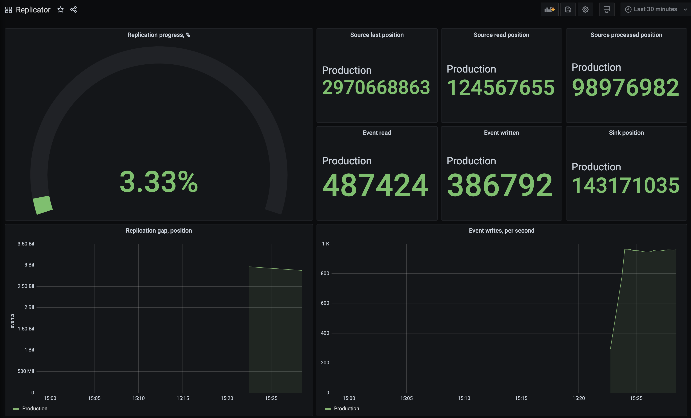

You can run Replicator using [Docker Compose](https://docs.docker.com/compose/), on any machine, which has Docker installed.

We prepared a complete set of files for this scenario. You find those files in the [Replicator repository](https://github.com/EventStore/replicator/tree/master/compose).

The Compose file includes the following components:
- Replicator itself
- Prometheus, pre-configured to scrape Replicator metrics endpoint
- Grafana, pre-configured to use Prometheus, with the Replicator dashboard included

## Configuration

Before spinning up this setup, you need to change the `replicator.yml` file. Find out about Replicator settings on the [Configuration]() page. We included a [sample](https://github.com/EventStore/replicator/blob/02736f6e3dd18e41d5536f26ca4f9497733d5f3f/compose/replicator.yml) configuration file to the repository.

The sample configuration file includes a JavaScript transform configuration as an example. It is not suitable for production purposes, so make sure you remove it from your configuration.

The sample configuration enables verbose logging using the `REPLICATOR_DEBUG` environment variable. For production deployments, you should remove it from the configuration.

## Monitoring

When you start all the component using `docker-compose up`, you'd be able to check the Replicator web UI by visiting [http://localhost:5000](http://localhost:5000), as well as Grafana at [http://localhost:3000](http://localhost:3000). Use `admin`/`admin` default credentials for Grafana. The Replicator dashboard is included in the deployment, so you can find it in the [dashboards list](http://localhost:3000/dashboards).

Watch out for the replication gap and ensure that it decreases.

