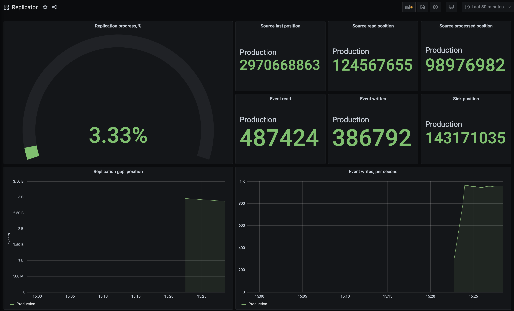

When the deployment finishes, you should be able to connect to the Replicator service by using port forwarding:

```bash
$ kubectl port-forward -n es-replicator svc/es-replicator 5000
```

The Replicator web interface should be then accessible via [http://localhost:5000](http://localhost:5000). The UI will display the replication progress, source read and target write positions, number of events written, and the replication gap. Note that the write rate is shown for the single writer. When you use concurrent writers, the speed will be higher than shown.

## Prometheus

If you have Prometheus in your Kubernetes cluster, we recommend enabling `prometheus.metrics` option. If the `prometheus.operator` option is set to `false`, the deployment will be annotated with `prometheus.io/scrape`.

If you have Prometheus managed by Prometheus Operator, the scrape annotation won't work. You can set both `prometheus.metrics` and `prometheus.operator` options to `true`, so the Helm release will include the `PodMonitor` custom resource. Make sure that your `Prometheus` custom resource is properly configured with regard to `podMonitorNamespaceSelector` and `podMonitorSelector`, so it will not ignore the Replicator pod monitor.

## Grafana

The best way to monitor the replication progress is using Prometheus and Grafana. If the pod is being properly scraped for metrics, you would be able to use the Grafana dashboard, which you can create by import it from [JSON file](grafana-dashboard.json).

Watch out for the replication gap and ensure that it decreases.


